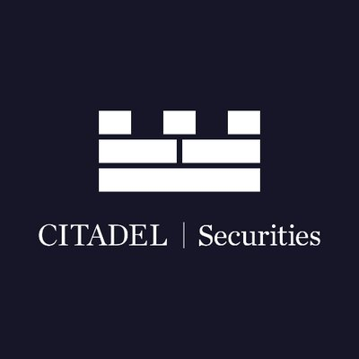

# Module-1-Challenge

## Overview and Origin

* What is the name of the company?

The name of the company is Citadel Securities which is based in Miami, Florida.

* When was the company incorporated?

Citadel Securities was incorporated in 2002.

* Who are the founders of the company?

Kenneth C. Griffin is the Founder of Citadel Securities. He also serves as the Chief Executive Officer and Co-Chief Investment Officer of Citadel.

* How did the idea for the company (or project) come about?

The idea for Citadel Securities came about when Kenneth Griffin was working as a trader at Goldman Sachs. He saw the potential for using technology to improve the efficiency of the financial markets. Kenneth left Goldman Sachs in 1990 to start his own hedge fund, Citadel LLC. In 1999, he founded Citadel Securities as a way to provide liquidity to the markets and to take advantage of the opportunities created by technology.

* How is the company funded? How much funding have they received?
  
Citadel Securities is a privately held company, so its financial information is not publicly available, however some insights into how the company is funded can be found by investigating  recent funding rounds. Citadel Securities raised a total of $1.2B in funding over 1 round through a Venture - Series Unknown round raised on Jan 11, 2022. The two most recent investors help fund Citadel Securities, Paradigm and Sequoia Capital.

## Business Activities

* What specific financial problem is the company or project trying to solve?

In the high-frequency trading (HFT) domain of the financial industry, speed is of the upmost important. Citadel Securities invests heavily in technology, including FPGA-based solutions, to execute trades with minimal latency. By Citadel reducing the time it takes to execute trades, they can obtain more favorable prices and exploits the tiny differences in price to gain better opportunities.
  
* Who is the company's intended customer? Is there any information about the market size of this set of customers?

Citadel Securities meets it's customers liquidity needs across a range of asset class from public pension programs to central banks and broker-dealers. The firm has said it handles about 40% of all US retail trading volume and one in every four US equities trades. It also serves more than 1,600 institutional clients, including sovereign wealth funds and central banks.

* What solution does this company offer that their competitors do not or cannot offer? (What is the unfair advantage they utilize?)

High-frequency trading needs to be done faster than the competition and the constant race to shave off vital microseconds have led to an increase in costs that makes business difficult.

* Which technologies are they currently using, and how are they implementing them? (This may take a little bit of sleuthing–– you may want to search the company’s engineering blog or use sites like StackShare to find this information.)

Citadel Securities invests heavily in cutting-edge technology and infrastructure for high-frequency trading applications. This includes the use of Field-Programmable Gate Arrays (FPGAs) and custom hardware, which can significantly reduce trade execution latency. Their technology-driven approach allows them to execute trades faster and more efficiently than many competitors. The firm also has a strong emphasis on quantitative research and data analysis. Their teams of researchers and data scientists work on developing and fine-tuning trading algorithms that can exploit market inefficiencies and opportunities. The "ability to analyze vast amounts of data and extract actionable insights" is definitely competitive advantage. Citadel's algorithm "creates and analyzes statistical themes for virtually every company and institution in the world,combing over a hundred fundamental inputs, dozens of valuation models and trend analyses into a powerful predictive engine". They "aggregate real-time data from investor datasets to identify potential investors based on our clients’ unique criteria".
The use of advanced technology and deep liquidity is not considered to be an unfair advantage by regulators. However, some critics argue that these advantages give HFT firms an unfair advantage over other market participants, such as retail investors.
 
## Landscape

* What domain of the financial industry is the company in?
  
It is in the high-frequency trading (HFT) domain of the financial industry. It is a type of algorithmic trading that use FPGAs to execute trades in millisecond or even microseconds.
HFT firms like Citadel Securities use advanced technology, algorithmic trading strategies and low-latency infrastructure to capitalize on small price discrepancies and market inefficiencies.

* What have been the major trends and innovations of this domain over the last 5–10 years?

The increased use of AI and machine learning have been major trends and innovations of this HFT domain that can predict price movements more accurately than traditional methods. For example, Citadel Securities uses AI and ML to develop algorithms that can identify patterns in order flow data. The use of high-speed computers, FPGAs to accelerate executing trades has disrupted the trading world and ethical questions about its applications have been raised and scrutinized over the decade. 

* What are the other major companies in this domain?

The domain of high-frequency trading (HFT) and market making includes several major companies that are significant players in the industry which include Virtus Financial, Tower Research Capital, Jump Trading and Jane Street Capital.
* Virtu Financial is a leading market maker and liquidity provider with a global presence and is known for its advanced technology and quantitative trading strategies.
* Tower Research Capital is an HFT firm specializing in algorithmic trading and quantitative research with a strong focus on technology and market-making activities.
* Jump Trading is an HFT firm involved in market making, proprietary trading, and algorithmic trading and are known for their quantitative research and technology-driven approach.
* Jane Street is a proprietary trading firm specializing in market making and algorithmic trading and primarily operate in equities, options, and ETFs markets.

## Results

* What has been the business impact of this company so far?

Citadel marked record revenues in its hedge fund and electronic-trading businesses for 2022 despite turmoil in global capital markets The hedge fund operation of Citadel made about $28 billion in revenue, while Citadel Securities, one of the world's biggest electronic-trading firms, brought in $7.5 billion.

* What are some of the core metrics that companies in this domain use to measure success? How is your company performing, based on these metrics?

The core metrics of Citadel Securities' competitors, Virtu Financial, Tower Research Capital, Jump Trading, and Jane Street Capital, are comparable or slightly lower than Citadel Securities' core metrics.

Core metrics for high-frequency trading companies are profitability, liquidity, risk, growth, innovation, and regulation. They also track fill rates, average execution price, market share, and volatility to identify areas for improvement.

* How is your company performing relative to competitors in the same domain?
  
Citadel Securities' competitors, Virtu Financial, Tower Research Capital, Jump Trading, and Jane Street Capital, are comparable or slightly lower than Citadel Securities in terms of core metrics such as profitability, liquidity, risk, growth, innovation, and regulation. Although Citadel Securities is the largest and most profitable of the five companies, its competitors are also known for their innovation and expertise in different areas of trading.

## Recommendations

* If you were to advise the company, what products or services would you suggest they offer? (This could be something that a competitor offers, or use your imagination!)
NOTE: If you have chosen a project within a larger company (such as the Apple credit card), you may want to focus your research on the origins and scope of the project rather than on the company itself.
something that a competitor offers, or use your imagination!)

I would advise the company to allow Algorithmic trading for retail investors. It is a concept where retail investors can access the same sophisticated trading tools and strategies that institutional investors use. This would allow retail investors to trade more efficiently and effectively, and to potentially generate higher returns. Algorithmic trading can help retail investors trade more efficiently, accurately and disciplinedly. It can also help them to manage their risk more effectively.

* Why do you think that offering this product or service would benefit the company?

Offering algorithmic trading for retail investors would allow Citadel Securities to expand its customer base, increase its revenue, and improve its brand reputation as a leader in the industry. In addition to these direct benefits, offering algorithmic trading for retail investors could also have indirect benefits for Citadel Securities. For example, by helping retail investors to trade more efficiently and effectively, Citadel Securities could contribute to a more liquid and efficient market. This would benefit all market participants, including Citadel Securities.

* What technologies would this additional product or service utilize?

The FPGAs used in Citadel Securities HFT applications could be used to accelerate order matching, risk management, and market data analysis for retail investors using algorithmic trading. This would allow Citadel Securities to offer its retail clients faster execution, better liquidity, and more robust risk management.

* Why are these technologies appropriate for your solution?

FPGAs, cloud computing platforms, and machine learning offer the performance, scalability, reliability, and security necessary for algorithmic trading for retail investors.
In addition to these benefits, the technologies I suggested are also appropriate for this solution because they are becoming more affordable and accessible. This means that Citadel Securities could offer its algorithmic trading platform to retail investors at a competitive price. 

Cited sources: 

[https://en.wikipedia.org/wiki/Kenneth_C._Griffin](https://en.wikipedia.org/wiki/Kenneth_C._Griffin)

[https://en.wikipedia.org/wiki/Citadel_Securities](https://en.wikipedia.org/wiki/Citadel_Securities)

[https://www.citadel.com/our-teams/leadership/kenneth-c-griffin/](https://www.citadel.com/our-teams/leadership/kenneth-c-griffin/)

[[https://www.citadel.com/our-teams/leadership/](https://www.citadelsecurities.com/our-teams/leadership/)](https://www.citadelsecurities.com/our-teams/leadership/)https://www.citadelsecurities.com/our-teams/leadership/)

[https://www.crunchbase.com/organization/citadel-securities/company_financials](https://www.crunchbase.com/organization/citadel-securities/company_financials)

[https://www.crunchbase.com/organization/citadel-securities](https://www.crunchbase.com/organization/citadel-securities)

[https://www.sec.gov/Archives/edgar/data/1146184/000128417022000004/CDRG_BS_Only_FS_2021.pdf](https://www.sec.gov/Archives/edgar/data/1146184/000128417022000004/CDRG_BS_Only_FS_2021.pdf)

[https://www.bloomberg.com/news/articles/2023-01-05/ken-griffin-s-citadel-securities-posts-record-revenue-hedge-fund-surges#xj4y7vzkg](https://www.bloomberg.com/news/articles/2023-01-05/ken-griffin-s-citadel-securities-posts-record-revenue-hedge-fund-surges#xj4y7vzkg)

[https://www.citadelsecurities.com/news-and-insights/how-does-citadel-securities-compete-and-innovate/](https://www.citadelsecurities.com/news-and-insights/how-does-citadel-securities-compete-and-innovate/)

[https://www.planetcompliance.com/introduction-hft-industry-top-20-hft-firms-world/#Analysis_of_HFT_Activity](https://www.planetcompliance.com/introduction-hft-industry-top-20-hft-firms-world/#Analysis_of_HFT_Activity)

[https://www.citadelsecurities.com/valuation-metrics/](https://www.citadelsecurities.com/valuation-metrics/)

[https://www.ft.com/content/2fd20c68-6d42-4663-9957-47911cc6c0c5](https://www.ft.com/content/2fd20c68-6d42-4663-9957-47911cc6c0c5)

[https://economictimes.indiatimes.com/markets/expert-view/retail-investor-trading-set-to-be-driven-by-algos-with-democratisation-of-tech-utrade-solutions/articleshow/101205920.cms?from=mdr]
(https://economictimes.indiatimes.com/markets/expert-view/retail-investor-trading-set-to-be-driven-by-algos-with-democratisation-of-tech-utrade-solutions/articleshow/101205920.cms?from=mdr)
